----

Single Nucleotide Polymorphism (SNP)

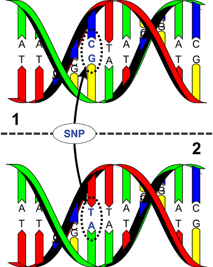

<aside class="notes">
DNA encodes genetic information

humans share 99+ DNA yet exhibit a wide range of traits: height or disease suscep.

genetic *VARIATION*
</aside>

----

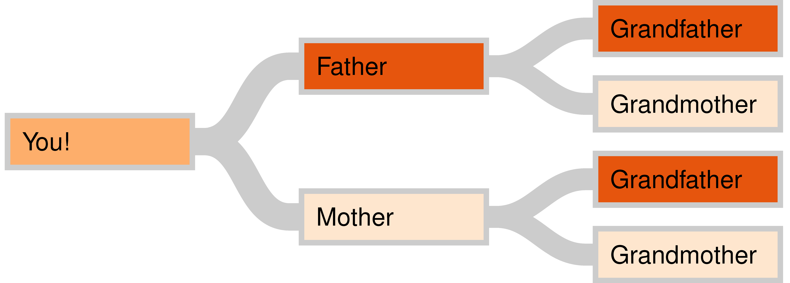

<aside class="notes">
Genetic information is inherited 

two copies of each chromosome

variants are passed between generations
</aside>

----

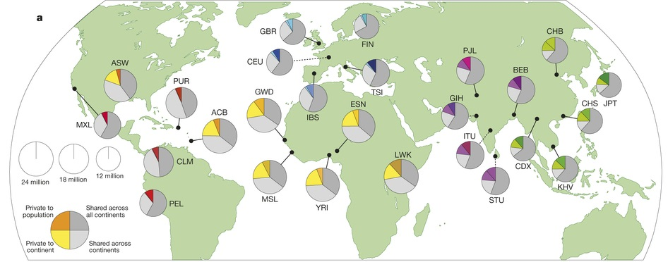

Source: 1000 Genomes Project Consortium, _Nature_ (2015)

<aside class="notes">
key takeaway: colored wedges represent proportion of genetic variation not shared by other locations 

distribution of genetic variation is affected by migration, environement, history
also evo forced selection

modeling the dependence structure of genome wide variation is important to understanding how genetics works
</aside>

----

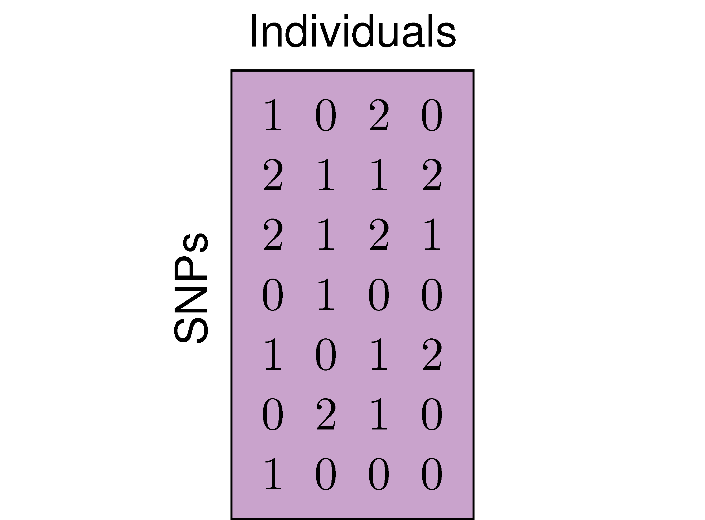

<aside class="notes">
describe why 0 1 2

describe rows and columns

describe scale
</aside>

----

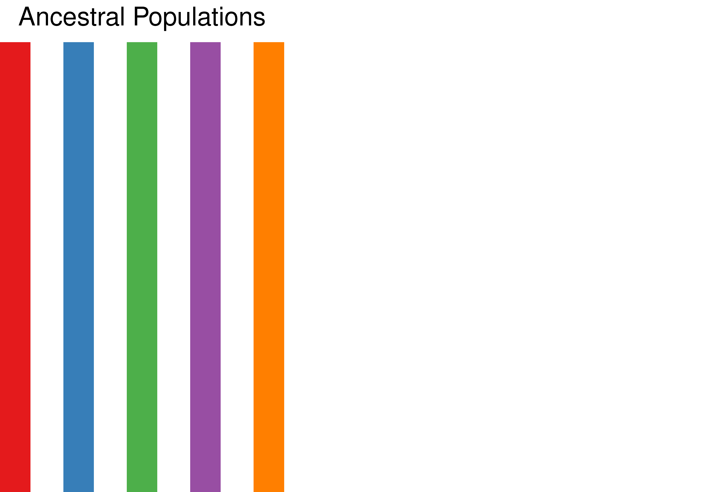

<aside class="notes">
we are interested in dependence between individuals

assume there exists an abstract ancestral pop.

discrete number of pops
</aside>

----

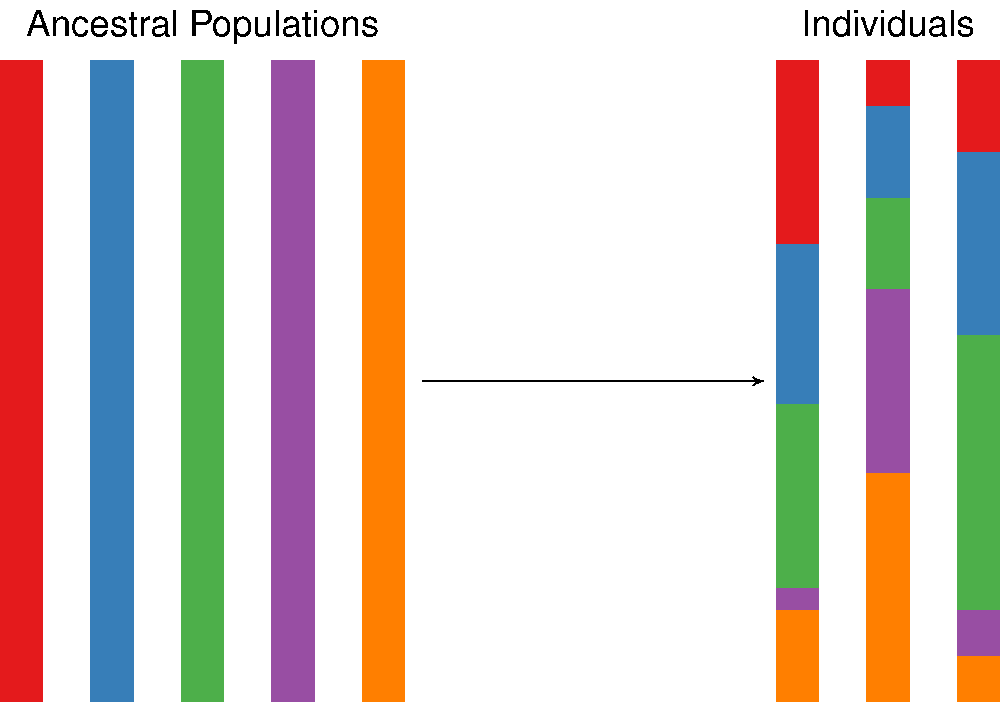

<aside class="notes">
proportions sum to 1

multi colored vertical bars are people

how does this affect SNPs?
</aside>

----

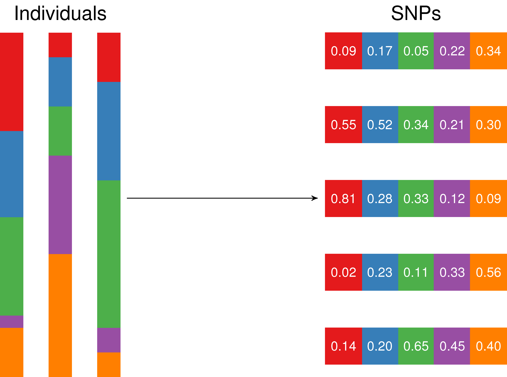

<aside class="notes">
each ancestral pop has a frequency of seeing a particular variant

rows are SNPs

weighted sums
</aside>

----

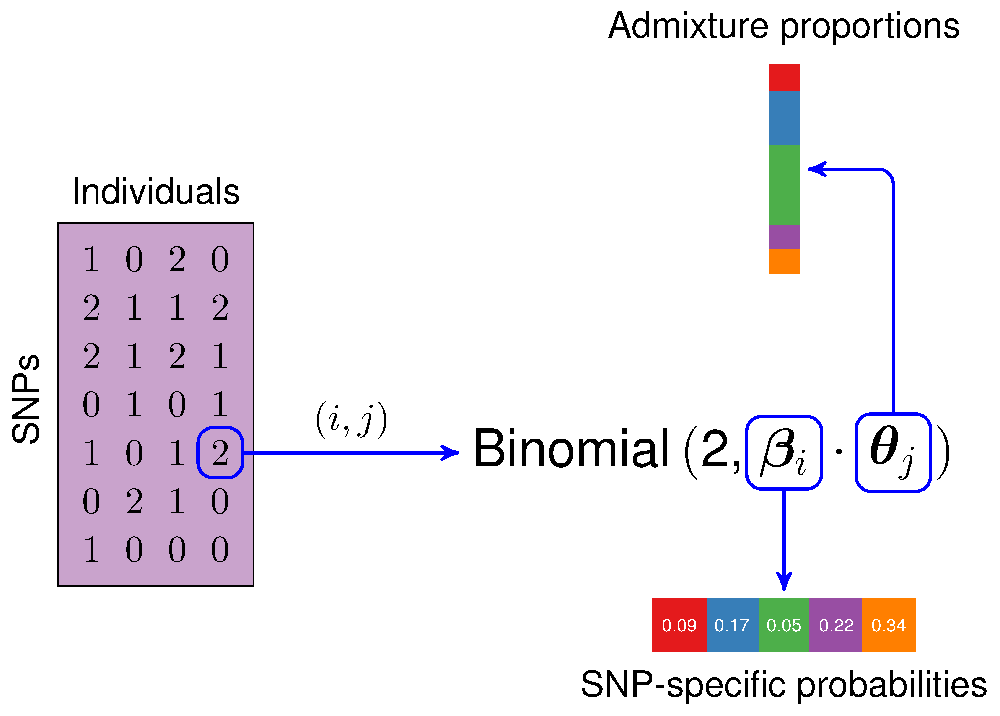

<aside class="notes">
puts together as BAYESIAN MODEL

walk through the arrows starting from (i,j)

POPULATION STRUCTURE b/w individuals

how the structured is manifested on a SNP by SNp basis
</aside>

----

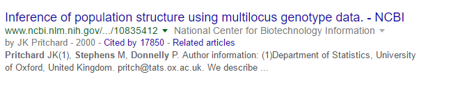

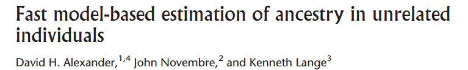

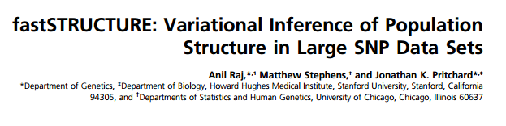

<aside class="notes">
Mention methods/scale

Comparisons with ADX and FS
</aside>

----

23andMe: 450K+ individuals

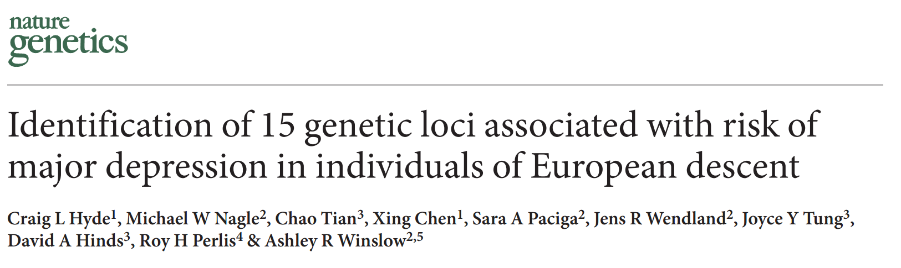

<aside class="notes">
pop struct is confounder

existing methods can't fit at this scale

"european descent" is in part concession to that fact
</aside>

## TeraStructure

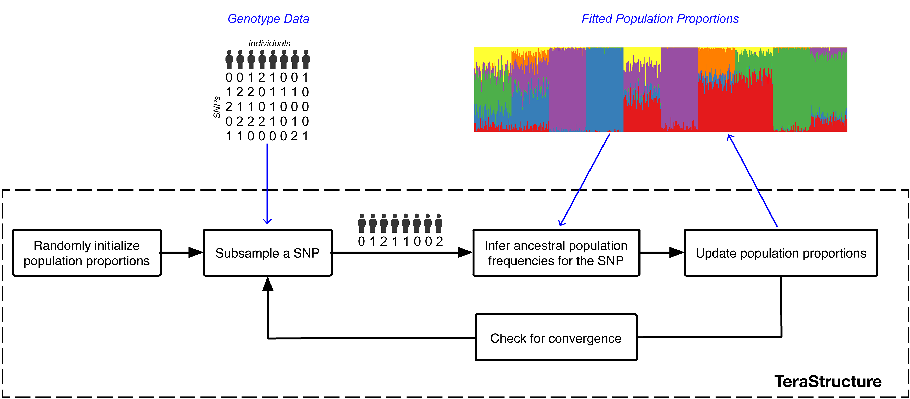

Stochastic variational inference (Hoffman et al 2013)

<aside class="notes">
name; method

local v global

big adv is don't care about number of SNPs; don't even need data in RAM
</aside>

## 1000 Genomes K=7

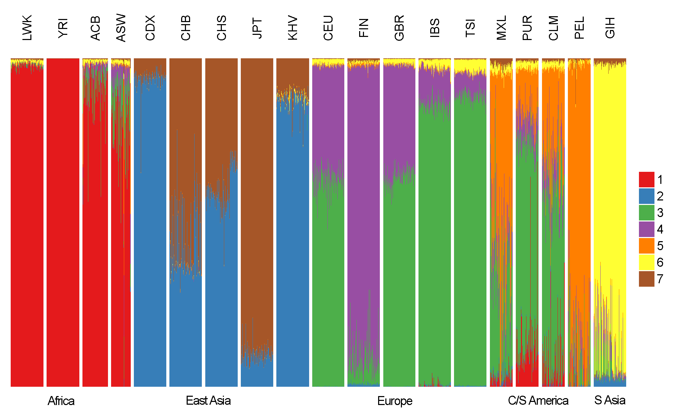

<aside class="notes">
explain **indvs** and **geo** and **ancestral pops** and **k**

to interpret this kind of figure...
</aside>

## 1000 Genomes K=8

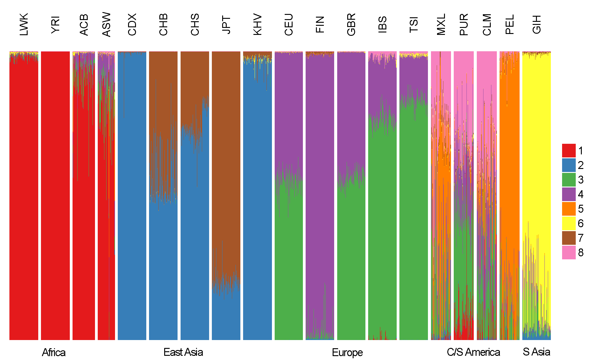

<aside class="notes">
**increased K**

gain resolution in south/central AM
</aside>

----

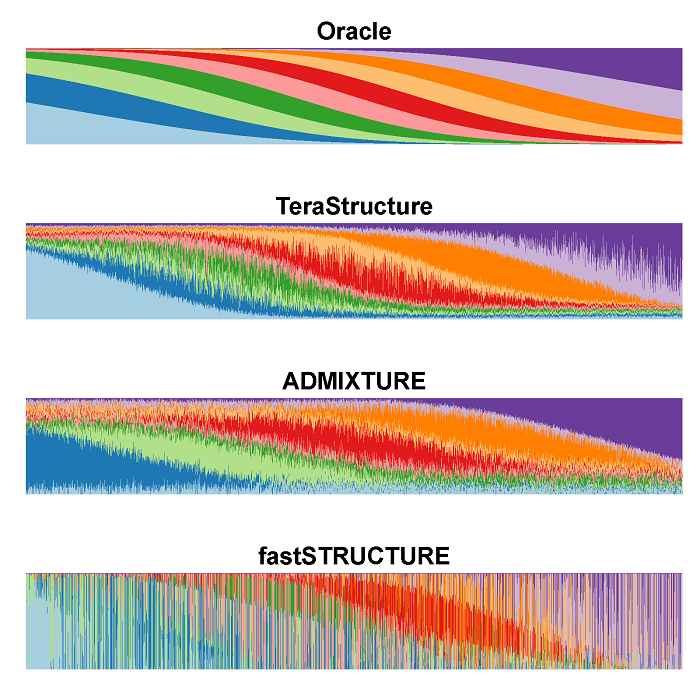

<aside class="notes">
we also ran a few simulations

this is a "hard simulation" 

introduce **ORACLE**

K=10, 1M by 10K
</aside>

----

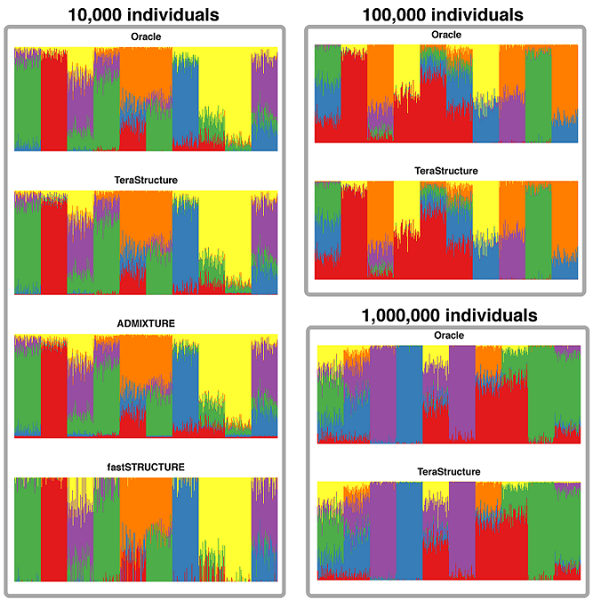

<aside class="notes">
This demonstrates scalability

K=6, 1M SNPs
</aside>

----

Many more details in our preprint: http://biorxiv.org/content/early/2015/05/28/013227

<aside class="notes">
to summarize briefly, we devel-ed a method, terastructure, to infer population structure in large scale genetic datasets of up to 1M. 

</aside>

## Acknowledgments 

Co-authors:

- Prem Gopalan
- David M. Blei
- John D. Storey

Funding:

- NIH R01 HG006448
- NIH P50 GM071508

<aside class="notes">
since this is a PICSciE research computing event, seems appropriate to thank the computers
</aside>

## A very special thanks to 

Our PICSciE administered machines:

- `hex.princeton.edu`
- The Muppets: 
    - `statler.princeton.edu`
    - `waldorf.princeton.edu`

